  

# Cześć, tu Ksawery!

## 🛠️ Mój Stack

  
  
  
  
  

  
  
  
  
  

  
  
  
  

## 📊 Moje Statystyki

  
  

  

## 🐍 Aktywność

  

## 📈 Szczegółowe Metryki

## 🎧 Czego aktualnie słucham

 

<table align="center" width="100%">
  <tr>
    <td align="center" style="padding: 20px; background-color: #0d1117; border: 1px solid #30363d; border-radius: 10px;">
      <kbd>🎧 AKTUALNIE NA MOICH SŁUCHAWKACH</kbd>
        
      
        
      
Mój profil aktualizuje się na żywo w aplikacji Spotify!

    </td>
  </tr>
</table>
